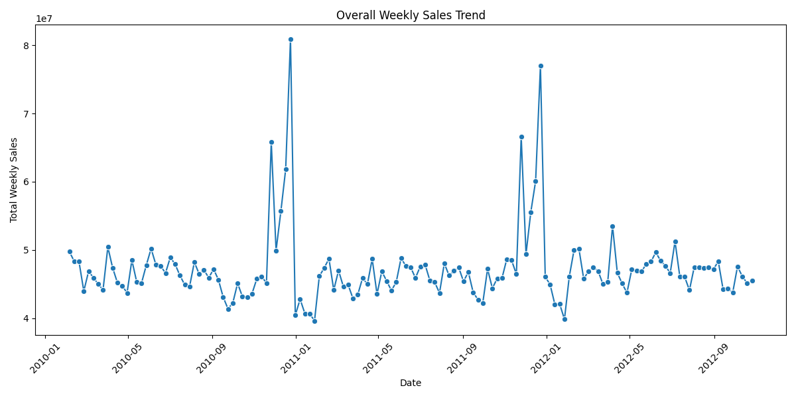
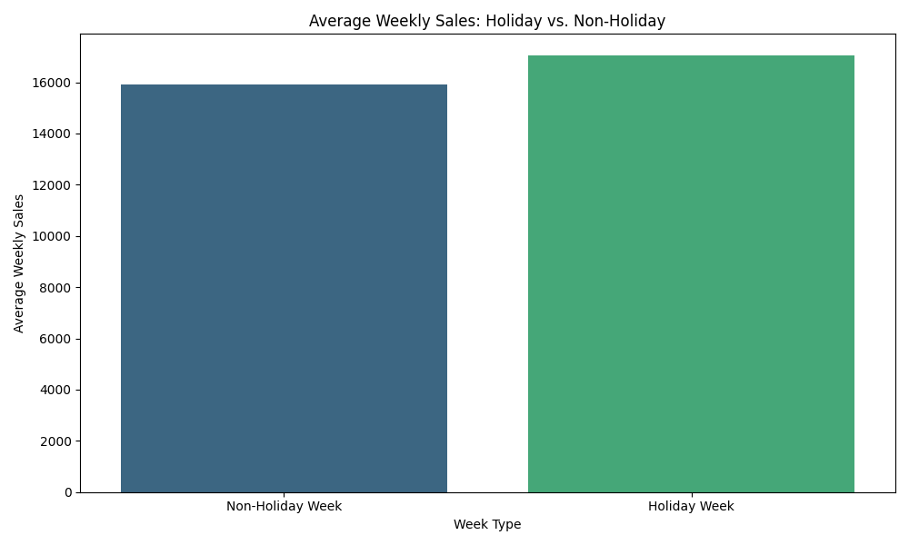

# 

# Retail Sales Data Analysis Project

## Dataset Content

The analysis is based on a retail sales dataset from Kaggle. The dataset is comprised of three key files: `Sales.csv`, `Features.csv`, and `Stores.csv`. These files contain transactional data, external factors such as holidays and markdown promotions, and store-specific details, respectively. The dataset is of a manageable size, allowing for efficient processing without exceeding typical repository size limits.

---

## Project Structure

The repository is organized to keep the data, code, and output separate and easy to manage.

```
├── .vscode/                 # VS Code settings and launch configurations
├── data/                    # Contains all data files
│   ├── raw/                 # Original, untouched data
│   └── processed_data/      # The final cleaned dataset
├── outputs/                 # Visualization outputs
│   ├── descriptive_statistics/
│   ├── trend_analysis/
│   ├── impact_analysis/
│   └── comparative_analysis/
├── images/                  # Screenshots for README.md
├── jupyter_notebooks/       # Jupyter notebooks and Python scripts
│   ├── ETL_Pipeline.ipynb   # Notebook for data cleaning and processing
│   ├── interactive_visualisations.ipynb # Notebook for interactive Plotly charts
│   └── data_visualisation/  # Python scripts for static plots
│       ├── 1_descriptive_statistics.py
│       ├── 2_trend_analysis.py
│       ├── 3_impact_analysis.py
│       └── 4_comparative_analysis.py
├── .gitignore               # Specifies files and directories to ignore in Git
├── README.md                # Project overview and documentation
└── requirements.txt         # List of project dependencies
```

---

## Business Requirements

The business requirements for this project are to provide actionable insights for a retail company. The key requirements are to:

1.  **Identify Sales Trends:** Understand weekly, monthly, and seasonal sales patterns.
2.  **Assess Promotional Impact:** Quantify the effect of holiday weeks and markdown promotions on sales performance.
3.  **Compare Store Performance:** Benchmark the performance of different store types (A, B, C) and individual stores against each other.

---

## Key Findings

Based on the ETL and data visualization, the following key insights were uncovered:

- **Sales Trends:** The overall sales trend shows clear seasonality, with significant peaks during holiday periods. By comparing individual stores (as shown in the `trend_analysis` plots), we can see that while all stores follow a similar seasonal pattern, some consistently outperform others.
- **Holiday & Promotional Impact:** Holidays have a substantial positive impact on sales, with average weekly sales being significantly higher during holiday weeks. The interactive scatter plot in the Jupyter Notebook visualizes a clear correlation between markdown promotions and an increase in sales, especially during these key shopping times.
- **Comparative Performance:** Store types **A** generally have the highest average weekly sales, followed by type **B** and then type **C**. This indicates that store size and type are major factors in sales performance, as evidenced by the bar charts in the `comparative_analysis` output.

---

## Hypothesis and Validation

- **Hypothesis 1:** Holiday weeks have a significant positive impact on weekly sales.
  - **Validation:** I will validate this by comparing the average weekly sales during holiday weeks to the average weekly sales during non-holiday weeks. Visualizations will show sales spikes during these periods.
- **Hypothesis 2:** Store type is a major predictor of sales performance, with larger store types (e.g., Type A) outperforming smaller ones.
  - **Validation:** I will validate this by calculating and visualizing the average weekly sales for each store type. A comparative analysis will show a clear hierarchy in sales performance based on store type.
- **Hypothesis 3:** Markdown promotions are correlated with an increase in sales.
  - **Validation:** I will validate this by plotting markdown values against weekly sales. The visualization will highlight a relationship between markdown events and a corresponding increase in sales, especially during holiday periods.

---

## Project Plan

The analysis followed a structured pipeline based on the Extract, Transform, Load (**ETL**) process, which is documented in the `ETL_Pipeline.ipynb` notebook.

### Rationale for Methodologies

I chose a quantitative research methodology focused on descriptive and comparative analysis. This approach was ideal because the business requirements were to understand and compare existing patterns and trends in the sales data. The ETL pipeline, followed by visualization, allowed for a systematic and reproducible way to answer the business questions.

---

## The Rationale for Visualizations

Each visualization was designed to directly address a core business requirement.

### 1\. Sales Trends

- **Rationale:** Line plots are used to show sales patterns over time, revealing seasonality and peaks.
- **Visualizations:**
  - **Static:** `overall_weekly_sales_trend.png`
  - **Interactive:** An interactive Plotly line chart in the `interactive_visualisations.ipynb` notebook.

### 2\. Promotional Impact

- **Rationale:** Bar charts and scatter plots are used to assess the impact of holidays and markdown promotions on sales.
- **Visualizations:**
  - **Static:** `sales_by_holiday_impact.png` and `markdown_by_holiday_impact.png`
  - **Interactive:** An interactive Plotly scatter plot in the `interactive_visualisations.ipynb` notebook.

### 3\. Store Performance Comparison

- **Rationale:** Bar charts provide a clear visual comparison of average sales across different store types, making it easy to identify top performers.
- **Visualizations:**
  - **Static:** `average_sales_per_store_type.png`
  - **Interactive:** An interactive Plotly bar chart in the `interactive_visualisations.ipynb` notebook.

---

## Analysis Techniques Used

The analysis is structured into a dedicated **Jupyter Notebook** for the ETL process, four Python scripts for static visualizations, and another notebook for interactive plots. This modular approach makes the code easy to read, maintain, and debug.

- **Descriptive Statistics:** I calculated measures like mean and median to understand sales distribution.
- **Time Series Analysis:** I used line plots to visualize sales data over time to identify trends.
- **Interactive Data Exploration:** This is a key part of the project, where interactive plots created with **Plotly** allow for dynamic exploration of data.

### Use of Generative AI Tools

Generative AI was used to assist in several key areas:

- **Ideation:** Brainstorming different visualization types that could best represent the data.
- **Design Thinking:** Structuring the `README.md` and organizing the project workflow.
- **Code Optimization:** Refining and optimizing Python scripts for data cleaning and plotting.

---

## Ethical Considerations

There were no significant data privacy or bias issues with this dataset. The data is anonymized, containing no personal customer information. It focuses solely on transactional and store-level data. The dataset is a sanitized and public-facing record from a competition, so there were no legal or societal issues to overcome.

---

## Dashboard Design

The project did not include a live dashboard, but the analysis served as the foundation for a potential dashboard. Each script was designed to generate a single visual output that would serve as a widget on a dashboard page. The generated images and the Key Findings section of this `README.md` are designed for a non-technical audience, while the code and detailed comments are for a technical one.

### Static Visualizations

These `.png` images are automatically saved to their respective folders in the `outputs` directory. They provide a quick overview of the data.

**1. Overall Weekly Sales Trend**


**2. Sales by Holiday Impact**


**3. Average Sales by Store Type**


### Interactive Visualizations

The interactive plots, created with Plotly, are designed for a deeper, hands-on exploration of the data and are best viewed by running the `interactive_visualisations.ipynb` notebook. Below are static images of these plots for quick reference.

**1. Interactive Sales Trend Plot**
This line chart shows the overall weekly sales trend. It allows users to zoom in on specific periods.


**2. Interactive Sales Comparison by Store Type**
This bar chart compares the average weekly sales across different store types.


**3. Interactive Markdown Impact Scatter Plot**
This scatter plot visualizes the relationship between markdown amounts and weekly sales.


---

## Future Work & Limitations

- **Challenges and Strategies:** A key challenge was efficiently merging the three large datasets while handling the different data types and missing values. The strategy to overcome this was to use the powerful data manipulation capabilities of the pandas library, specifically the `merge()` and `fillna()` methods, and to carefully inspect the dataframes at each step.
- **Future Skills:** Based on this experience, I plan to learn Plotly for creating interactive and dynamic visualizations. I also want to explore predictive modeling and machine learning with libraries like Scikit-learn to build a sales forecasting model.
- **Deployment:** This project is not a web application and does not require deployment to Heroku. However, if it were to be deployed as a dashboard, the process would follow standard steps, including containerization and using a tool like Heroku.

---

## How to Run the Project

To run this project and generate all visualizations, follow these steps:

1.  **Clone the Repository:**

    ```bash
    git clone <repository-url>
    ```

2.  **Activate your virtual environment and install dependencies:**

    ```bash
    source .venv/Scripts/activate  # Or your platform's activation command
    pip install -r requirements.txt
    ```

3.  **Run the ETL Pipeline:** Open and run all cells in the `ETL_Pipeline.ipynb` notebook.

4.  **Generate Static Visualizations:** Run the Python scripts from your terminal.

    ```bash
    python jupyter_notebooks/data_visualisation/1_descriptive_statistics.py
    python jupyter_notebooks/data_visualisation/2_trend_analysis.py
    python jupyter_notebooks/data_visualisation/3_impact_analysis.py
    python jupyter_notebooks/data_visualisation/4_comparative_analysis.py
    ```

5.  **View Interactive Visualizations:** Open `interactive_visualisations.ipynb` and run the cells.

---

## Main Data Analysis Libraries

- **`pandas`**: Used for all data manipulation, cleaning, and transformation tasks.
- **`matplotlib`**: Used for creating static visualizations.
- **`seaborn`**: Used to create more complex statistical plots.
- **`plotly`**: Used for creating interactive visualizations.

---

## Credits

- **Content:** The project's data was sourced from a Kaggle competition: Retail Sales Data Analysis.
- **Media:** All visualization images were generated from the analysis scripts.

---

## Acknowledgements

I would like to thank my peers for their valuable feedback and my instructors and coaches for guidance on best practices in data analysis.
